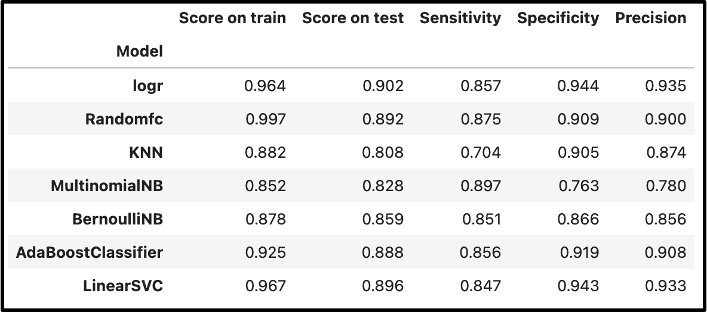

### AI Text Detector

---

**Problem Statement**

To develop an AI text detector for distinguishing between human-generated and AI-generated text with increased accuracy

**Data Collection**

**SubReddits used for collecting data**

The following subreddits were selected to gather question-answer pairs, and the same questions were utilized to obtain responses from CHATGPT.

- science
- relationship_advice
- funny
- NoStupidQuestions
- AskReddit
- gaming
- unresolvedmysteries
- wewantplates
- disneyvacation
- talesfromretail
- antiMLM
- IDontWorkHereLady
- nevertellmetheodds
- publicfreakout

---
**Here, we have divided the modeling part into two sections.**

- Model with Countvectorizer.
- Model with TfidfVectorizer

Below is the list of classification models used  

**The models that we used here:**

- LogisticRegressionCV
- MultinomialNB
- BernoulliNB
- KNN Classifier
- RandomForest Classifier
- AdaBoost Classifier
- SVM Classifier

Among the options mentioned above, we discovered that the LogisticRegressionCV model, combined with the CountVectorizer, outperformed the others. The results from the confusion matrix and model evaluation strongly support the conclusion that this particular model is the most effective.

**Conclusion**

---

Our findings indicate that retaining stopwords within our model enhances the accuracy of the AI text detector. Remarkably, the highest accuracy is achieved when employing the logistic regression with cross-validation (LogisticRegressionCV) model.

